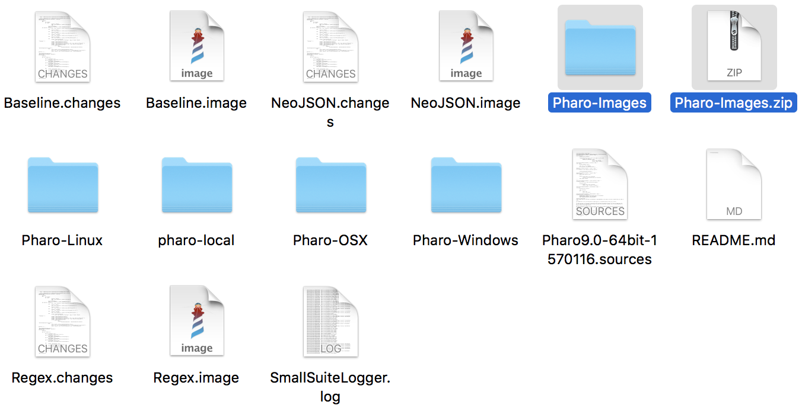
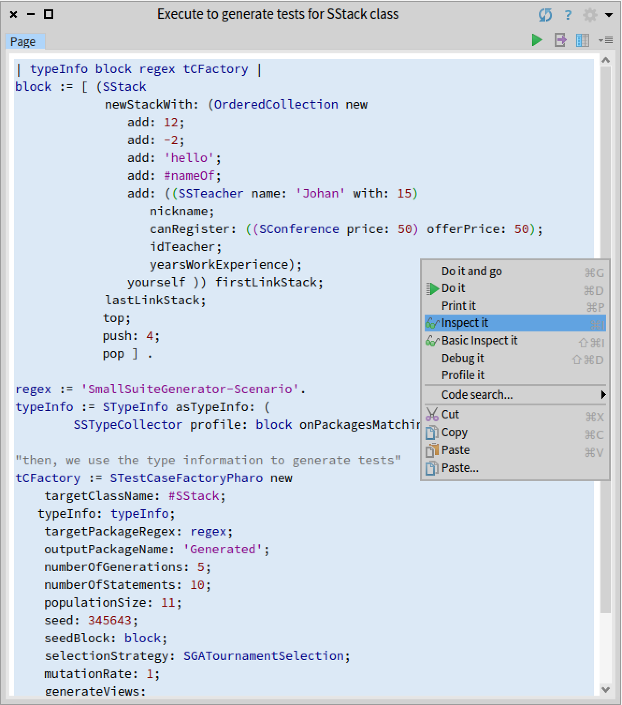
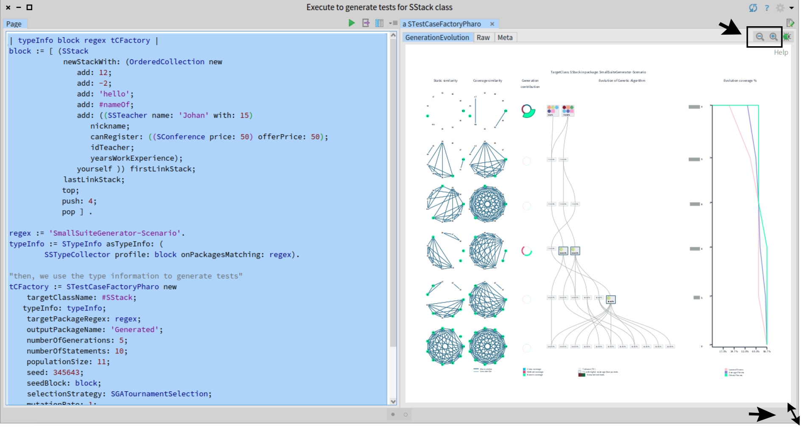

# ArtifactTestEvoViz

The repository includes the artifacts to replicate the case studies of TestEvoViz.

## Pharo images

After downloading the repository, uncompres Pharo-Images.zip file (it includes the Pharo images to execute). Copy all the files of Pharo-Images folder at ArtifactTestEvoViz folder (folder of repository).



You can delete the Pharo-Images.zip and Pharo-Images folder if you like.

## SmallSuiteGenerator and TestEvoViz examples

To replicate the case studies and visualize TestEvoViz examples, of paper, execute the next commands on Terminal where the project was downloaded.

**Hint:** We do and test all experiments on Mac Book Pro, Linux (Debian Stretch) and Windows, all of 64-bits. So, it's recommendable you execute commands on 64-bits Operating System. Another way it will give an error.

### Pharo image

Open the Pharo image executing the next commands according your OS.

**MacOSX**

```
./Pharo-OSX/Pharo.app/Contents/MacOS/Pharo Baseline.image
```

**Linux** The command was tested on Debian, if you have another distribution it could give errors or not.

```
./Pharo-Linux/pharo-ui Baseline.image
```

**Windows** Experiments were tested on Windows 10 (64-bits). Depending on your Windows version you've installed it may have some some UI bugs.

```
cd Pharo-Windows
Pharo.exe ..\Baseline.image
```

### Open the visualization

Execute the code using the green play button (at the top right of the window). Another option is selecting all the code with `Ctrl + A` (`Command + A` for MacOS), right click on window and select "Inspect Code" option or press `Ctrl + I` (`Command + I` for MacOS). 



After doing that a window will appear, asking you write your name (Is's part of Pharo).
If the visualization window is very tiny or small you can extend it. Furthermore, there are options to zoom in or zoom out the visualization.



Baseline image contains four scripts of SStack, DataFrame, Regex and NeoJSON, you can change some values of the scripts to test. Values to changes are: 
 - `numberOfIterations:`. You can change for any positive integer number greater than 1. But you must be careful with using pretty high values, e.g. greater than 50.
 - `numberOfStatements:`. Positive integer number greater than 1. Be careful of using high values.
 - `populationSize:`. Positive integer number greater than 1. Be careful of using high values. 
 - `mutationRate:`. Positive number greater than 0 and less than 1. By default the value is 1/3.
 
 ## Experiment
 
 For replicating the experiments shown in the paper:
  1. Open the image Pharo (described below)
  2. Execute the code that appears in the image (use the green play button or Inspect command, described previously).

Note that due randomness of the genetic algorithm, the visualization can vary a bit between executions.

### Regex 

Regex image contains three scripts to execute.

**MacOS**
```
./Pharo-OSX/Pharo.app/Contents/MacOS/Pharo Regex.image
```
**Linux**
```
./Pharo-Linux/pharo-ui Regex.image
```
**Windows**
```
cd Pharo-Windows
Pharo.exe ..\Regex.image
```

### NeoJSON

In the same way NeoJSON image contains three examples to execute.

**MacOS**
```
./Pharo-OSX/Pharo.app/Contents/MacOS/Pharo NeoJSON.image
```
**Linux**
```
./Pharo-Linux/pharo-ui NeoJSON.image
```
**Windows**
```
cd Pharo-Windows
Pharo.exe ..\NeoJSON.image
```

### Box2DLite

In the same way Box2DLite image contains three examples to execute.

**MacOS**
```
./Pharo-OSX/Pharo.app/Contents/MacOS/Pharo Box2DLite.image
```
**Linux**
```
./Pharo-Linux/pharo-ui Box2DLite.image
```
**Windows**
```
cd Pharo-Windows
Pharo.exe ..\Box2DLite.image
```
